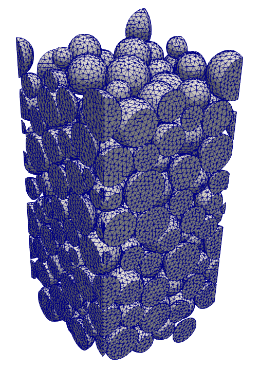

# pymesh

**Pymesh** is a flexible, Python-based packed-bed column meshing tool for chromatography simulations, built as a wrapper around [GMSH](https://gmsh.info/). It's a cleaner rewrite of `genmesh`, with a modular architecture and simpler setup.



# Install

```bash
## install dependencies
pip install -r requirements.txt

## install editable source
pip install -e .
```

If gmsh is built from source, ensure that 

- `PYTHONPATH` points to `$GMSH_ROOT/lib` (or wherever the gmsh.py file is)
- `LD_LIBRARY_PATH` points to `$GMSH_ROOT/lib` (or wherever the gmsh{.so,.a} files are)

```bash
export PYTHONPATH=$GMSH_ROOT/lib
export LD_LIBRARY_PATH=$GMSH_ROOT/lib
```

# Usage

The script in `bin/` should be available in `$PATH` after the install. It is currently called `mesh`. Given the appropriate input file in yaml format, run: `mesh input.yaml`

<details>
<summary>📄 Example YAML Input</summary>

## Example config

```yaml
packedbed:
  packing_file:
    filename: packing.xyzd
    dataformat: <d
  nbeads: 4
  scaling_factor: 1.0
  # auto_translate: True
  particles:
    scaling_factor: 0.9997
    # modification: bridge | cut 
    # relative_bridge_radius: ...
container:
  shape: cylinder
  size: [ 0.0, 0.0, -0.5, 0.0, 0.0, 4.0, 0.5 ]
  # size: [-2, -2, 0, 4, 4, 4]
  # periodicity: 
  # linked: True
  # stack_method: planecut
  # inlet_length: 0.0
  # outlet_length: 0.0
mesh:
  # size: 0.15
  size_method: field
  field:
    threshold:
      size_in: 0.06
      size_out: 0.14
      rad_min_factor: 0.4
      rad_max_factor: 0.6
  algorithm: 5
  algorithm3D: 10
  generate: 2
output:
  filename: mesh.vtk
gmsh:
  General.Verbosity: 5
  Geometry.OCCParallel: 1
  Mesh.MaxNumThreads1D: 8
  Mesh.MaxNumThreads2D: 8
  Mesh.MaxNumThreads3D: 8
  Mesh.ScalingFactor: 0.0001
general:
  fragment: True
```


### Notes
- For `shape: cyl`, `size: [x, y, z, dx, dy, dz, r]`
- For `shape: box`, `size: [x, y, z, dx, dy, dz]`
- If `mesh.field.threshold.size_in` and `mesh.field.threshold.size_out` are not given, they default to `mesh.size`
- Set `general.fragment` to `False` to run a quick mesh and manual visual check for correct dimensions and intersecting volumes.
    - Best with `mesh.generate` set to `2`
    - Be aware that this breaks physical groups, matching periodic surfaces etc

</details>
